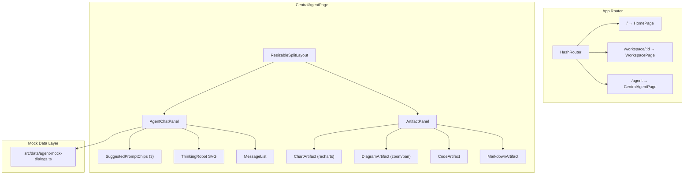

# Design Document: Central Agent Interactions

## Overview

This design describes a new "Central Agent Interactions" page for the OpenSearch Dashboard demo. The page provides a standalone, immersive AI agent experience. On page load, the chat panel is centered with a reasonable max-width (~720px). When the user clicks an artifact card in the chat, the page animates into a split-screen layout: the chat slides left and the artifact panel opens on the right, separated by a draggable resize handle. The user can close the artifact panel to return to the centered chat layout.

The core user flow is:
1. User navigates to the Central Agent page via the app router.
2. The page displays a centered chat panel with 3 suggested prompts — no artifact panel visible.
3. User clicks a suggested prompt, which triggers a pre-scripted mock dialog.
4. As the dialog progresses, agent messages appear with a simulated typing delay, preceded by a minimal geometric animated robot (thinking state).
5. When a dialog message includes a clickable artifact card and the user clicks it, the chat animates left and the artifact panel slides in from the right.
6. The user can drag the panel divider to resize chat vs. artifact space, or close the artifact panel to return to centered chat.

The page uses a dark navy accent color theme to create a focused, immersive feel distinct from the main dashboard.

Tech stack additions:
- **recharts** for chart artifacts (bar, line, area, pie charts)
- Custom SVG zoom/pan implementation for system diagram artifacts only
- Existing stack: React + TypeScript + Vite + Tailwind CSS v4 + shadcn/ui + lucide-react

## Architecture

The Central Agent page is a self-contained route that composes a few focused components. It does not depend on the existing OllyStateProvider or WorkspaceProvider — it manages its own dialog state locally.



### Key Architectural Decisions

1. **Self-contained page state**: The CentralAgentPage manages dialog state (current dialog, current turn index, active artifact, whether artifact panel is open) via local `useState`/`useReducer`. No global context needed — this page is independent of the existing Olly/Workspace system.

2. **Centered chat by default, animated split on artifact click**: On page load, the chat panel is centered with `max-width: 720px`. When the user clicks an artifact card, the layout transitions to split-screen using CSS transitions (`transition: all 300ms ease`). The chat panel animates from centered to left-aligned, and the artifact panel slides in from the right. Closing the artifact panel reverses the animation.

2. **Mock dialog as typed data**: All 3 mock dialogs are defined in a single TypeScript file (`src/data/agent-mock-dialogs.ts`) with strongly typed interfaces. Each dialog is an array of turns with sender, message, optional artifact reference, and delay.

3. **Resizable split via drag handle**: A custom `ResizableSplitLayout` component tracks mouse drag events to adjust the left/right panel widths. Minimum widths are enforced (e.g., 280px chat, 320px artifact). No external library needed — a simple `onMouseDown`/`onMouseMove`/`onMouseUp` pattern on a divider element.

4. **recharts for charts**: recharts is a well-maintained React charting library that integrates naturally with the component model. Chart artifacts pass data and config to recharts components (`BarChart`, `LineChart`, `AreaChart`, `PieChart`).

5. **Zoom/pan only for diagrams**: System diagram artifacts get a custom zoom/pan wrapper that handles wheel events (zoom) and pointer drag (pan) with CSS transforms. Other artifact types render without zoom/pan. This keeps the interaction model simple — only diagrams need spatial navigation.

6. **Dark navy theme via Tailwind classes**: The page applies dark navy background/text classes at the page root. No global theme change — the dark navy is scoped to this page's component tree using Tailwind utility classes (e.g., `bg-slate-900`, `text-slate-100`, `border-slate-700`).

7. **Thinking robot as inline SVG**: The thinking indicator is a minimal geometric SVG robot composed of basic shapes (rect, circle, line) with CSS animations (pulse, rotate). It's a small, self-contained component — no external animation library needed.

## Components and Interfaces

### CentralAgentPage

The top-level page component. Manages dialog state and renders the split layout.

```typescript
// src/pages/CentralAgentPage.tsx
interface DialogState {
  activeDialogId: string | null;
  currentTurnIndex: number;
  isThinking: boolean;
  activeArtifact: ArtifactData | null;
  isArtifactPanelOpen: boolean;
  messages: DialogMessage[];
}
```

### ResizableSplitLayout

A generic horizontal split layout with a draggable divider.

```typescript
interface ResizableSplitLayoutProps {
  left: React.ReactNode;
  right: React.ReactNode;
  defaultLeftWidth?: number;    // percentage, default 40
  minLeftWidth?: number;        // pixels, default 280
  minRightWidth?: number;       // pixels, default 320
}
```

The divider is a narrow vertical bar (4–6px wide) that changes cursor to `col-resize` on hover and highlights on drag.

### AgentChatPanel

The left panel — shows suggested prompts, message list, thinking robot, and input area.

```typescript
interface AgentChatPanelProps {
  messages: DialogMessage[];
  isThinking: boolean;
  hasActiveDialog: boolean;
  onPromptClick: (dialogId: string) => void;
  onSendMessage: (text: string) => void;
}
```

### SuggestedPromptChips

Displays 3 prompt chips. Hidden once a dialog is active.

```typescript
interface SuggestedPromptChipsProps {
  prompts: { id: string; label: string; description: string }[];
  onSelect: (dialogId: string) => void;
}
```

### ThinkingRobot

Minimal geometric animated SVG robot.

```typescript
interface ThinkingRobotProps {
  size?: number; // default 48
}
```

The robot is composed of:
- A rectangular body with rounded corners
- Circular eyes that blink (opacity animation)
- Small antenna with a pulsing circle on top
- Subtle floating animation (translateY oscillation)

### ArtifactPanel

The right panel — renders the active artifact or an empty state.

```typescript
interface ArtifactPanelProps {
  artifact: ArtifactData | null;
  onClose: () => void;
}
```

Routes to the correct renderer based on `artifact.type`. Includes a close button that calls `onClose` to collapse the artifact panel and return to centered chat.

### ChartArtifact

Renders chart data using recharts.

```typescript
interface ChartArtifactProps {
  config: ChartArtifactData;
}
```

Supports `bar`, `line`, `area`, and `pie` chart types. Each chart type maps to the corresponding recharts component.

### DiagramArtifact

Renders a system diagram with zoom/pan support.

```typescript
interface DiagramArtifactProps {
  config: DiagramArtifactData;
}
```

Implements zoom via wheel events and pan via pointer drag. Provides zoom controls (buttons for zoom in, zoom out, reset to fit). Uses CSS `transform: scale(z) translate(x, y)` on a wrapper div.

### CodeArtifact

Renders a code block with basic syntax highlighting.

```typescript
interface CodeArtifactProps {
  config: CodeArtifactData;
}
```

Uses a `<pre><code>` block with monospace font and a dark background. Language label displayed in the header.

### MarkdownArtifact

Renders markdown-formatted text.

```typescript
interface MarkdownArtifactProps {
  config: MarkdownArtifactData;
}
```

Renders headings, paragraphs, lists, and inline code using Tailwind typography classes.

## Data Models

### Mock Dialog Types

```typescript
// src/data/agent-mock-dialogs.ts

export type ArtifactType = 'chart' | 'diagram' | 'code' | 'markdown';

export interface ChartArtifactData {
  type: 'chart';
  chartType: 'bar' | 'line' | 'area' | 'pie';
  title: string;
  data: Record<string, unknown>[];
  xKey: string;
  yKeys: string[];
  colors?: string[];
}

export interface DiagramNode {
  id: string;
  label: string;
  x: number;
  y: number;
  type?: 'service' | 'database' | 'external' | 'queue';
  status?: 'healthy' | 'warning' | 'error';
}

export interface DiagramEdge {
  from: string;
  to: string;
  label?: string;
  style?: 'solid' | 'dashed';
}

export interface DiagramArtifactData {
  type: 'diagram';
  title: string;
  nodes: DiagramNode[];
  edges: DiagramEdge[];
}

export interface CodeArtifactData {
  type: 'code';
  title: string;
  language: string;
  code: string;
}

export interface MarkdownArtifactData {
  type: 'markdown';
  title: string;
  content: string;
}

export type ArtifactData =
  | ChartArtifactData
  | DiagramArtifactData
  | CodeArtifactData
  | MarkdownArtifactData;

export interface DialogMessage {
  id: string;
  sender: 'user' | 'agent';
  text: string;
  artifact?: ArtifactData;
  delayMs?: number; // simulated thinking delay before this message appears
}

export interface MockDialog {
  id: string;
  promptLabel: string;
  promptDescription: string;
  turns: DialogMessage[];
}

export const MOCK_DIALOGS: MockDialog[] = [
  // 3 dialogs defined here
];
```

### Dialog State

```typescript
interface DialogState {
  activeDialogId: string | null;
  currentTurnIndex: number;
  isThinking: boolean;
  activeArtifact: ArtifactData | null;
  isArtifactPanelOpen: boolean;
  messages: DialogMessage[];
}
```


## Correctness Properties

*A property is a characteristic or behavior that should hold true across all valid executions of a system — essentially, a formal statement about what the system should do. Properties serve as the bridge between human-readable specifications and machine-verifiable correctness guarantees.*

### Property 1: Drag resize respects minimum width constraints

*For any* container width and any drag delta applied to the split layout divider, the resulting left panel width and right panel width must both be at or above their respective minimum widths, and their sum (plus divider width) must equal the container width.

**Validates: Requirements 2.2, 2.3**

### Property 2: Message alignment matches sender

*For any* `DialogMessage` displayed in the chat panel, if the sender is `'user'` the message must be right-aligned, and if the sender is `'agent'` the message must be left-aligned.

**Validates: Requirements 3.4**

### Property 3: Mock dialog data structure validity

*For any* `MockDialog` in the `MOCK_DIALOGS` array, it must have a non-empty `turns` array, and for each turn: it must have a `sender` of `'user'` or `'agent'`, a non-empty `text` string, and if an `artifact` is present it must have a valid `type` field (`'chart'`, `'diagram'`, `'code'`, or `'markdown'`) with corresponding content fields populated.

**Validates: Requirements 4.2, 9.2, 9.3**

### Property 4: Artifact messages trigger artifact display

*For any* `DialogMessage` that contains an `artifact` field, when that message is the most recent agent message, the artifact panel must render an artifact whose type matches the message's artifact type.

**Validates: Requirements 4.4**

### Property 5: Thinking robot visibility matches isThinking state

*For any* dialog state, the thinking robot component is rendered if and only if `isThinking` is `true`. When `isThinking` transitions from `true` to `false`, the robot must be removed and the agent's response message must be visible.

**Validates: Requirements 5.1, 5.4**

### Property 6: Artifact panel renders correct component by type

*For any* `ArtifactData` value, the artifact panel must render the component corresponding to its `type` field: `'chart'` renders a recharts-based chart component, `'diagram'` renders the diagram component with zoom/pan, `'code'` renders a code block, and `'markdown'` renders formatted text.

**Validates: Requirements 6.1, 6.2, 6.3, 6.4**

### Property 7: Diagram zoom changes scale

*For any* system diagram artifact and any mouse wheel delta, applying the wheel event must change the CSS transform scale value in the direction indicated by the delta (positive delta zooms in, negative zooms out), clamped to min/max zoom bounds.

**Validates: Requirements 7.1**

### Property 8: Diagram pan changes translation

*For any* system diagram artifact and any pointer drag delta (dx, dy), the CSS transform translate values must change by (dx, dy) relative to their previous values.

**Validates: Requirements 7.2**

### Property 9: Zoom/pan only available for diagram artifacts

*For any* artifact whose type is not `'diagram'`, the artifact panel must not render zoom/pan controls or enable zoom/pan event handlers.

**Validates: Requirements 7.3**

## Error Handling

| Scenario | Handling Strategy |
|---|---|
| Mock dialog data missing or malformed | Validate `MOCK_DIALOGS` at module load. If a dialog has zero turns, skip it and log a warning. The UI shows only valid dialogs as suggested prompts. |
| Recharts rendering error | Wrap `ChartArtifact` in a React Error Boundary. On error, display a fallback message "Chart could not be rendered" with the chart title. |
| Diagram artifact with no nodes | Render the empty diagram canvas with a "No nodes to display" message. Zoom/pan controls remain available but have no effect. |
| Drag handle edge case (rapid mouse movement) | Use `requestAnimationFrame` throttling on the mousemove handler. If the mouse leaves the window during drag, treat `mouseup` on `document` as drag end. |
| Unknown artifact type | The `ArtifactPanel` switch/case falls through to a default that renders "Unsupported artifact type" with the type name. |
| Dialog turn with missing text | Skip the turn and advance to the next one. Log a warning to console. |

## Testing Strategy

### Unit Tests

Unit tests cover specific examples, edge cases, and component rendering. Use Vitest as the test runner and React Testing Library for component tests:

- Route `/agent` renders `CentralAgentPage` — validates Req 1.1
- Page renders both chat panel and artifact panel — validates Req 1.2
- Home navigation link is present — validates Req 1.3
- Drag handle element is rendered between panels — validates Req 2.1
- Exactly 3 suggested prompts displayed when no dialog is active — validates Req 3.1
- Clicking a suggested prompt starts the corresponding dialog — validates Req 3.2
- Text input area is present in chat panel — validates Req 3.3
- Suggested prompts hidden after one is clicked — validates Req 3.5
- `MOCK_DIALOGS` has exactly 3 entries — validates Req 4.1
- Empty artifact state shows placeholder — validates Req 6.5
- Diagram artifact renders zoom controls — validates Req 7.4

### Property-Based Tests

Property-based tests use `fast-check` as the PBT library with Vitest as the test runner. Each test runs a minimum of 100 iterations.

Each property test is tagged with a comment referencing the design property:

| Test | Property | Tag |
|------|----------|-----|
| Drag resize constraints | Property 1 | `Feature: central-agent-interactions, Property 1: Drag resize respects minimum width constraints` |
| Message alignment | Property 2 | `Feature: central-agent-interactions, Property 2: Message alignment matches sender` |
| Mock data validity | Property 3 | `Feature: central-agent-interactions, Property 3: Mock dialog data structure validity` |
| Artifact display | Property 4 | `Feature: central-agent-interactions, Property 4: Artifact messages trigger artifact display` |
| Thinking robot | Property 5 | `Feature: central-agent-interactions, Property 5: Thinking robot visibility matches isThinking state` |
| Artifact routing | Property 6 | `Feature: central-agent-interactions, Property 6: Artifact panel renders correct component by type` |
| Diagram zoom | Property 7 | `Feature: central-agent-interactions, Property 7: Diagram zoom changes scale` |
| Diagram pan | Property 8 | `Feature: central-agent-interactions, Property 8: Diagram pan changes translation` |
| Zoom/pan exclusivity | Property 9 | `Feature: central-agent-interactions, Property 9: Zoom/pan only available for diagram artifacts` |

Each correctness property is implemented by a single property-based test. Property tests generate random artifact data, dialog messages, drag deltas, zoom/pan inputs, and sender values to verify the properties hold universally.
