# Design Document: OpenSearch Dashboard with Olly AI Assistant

## Overview

This design describes an OpenSearch Dashboard demo application featuring Olly, an AI chatbot assistant. The application consists of two primary pages — a Home page and a Workspace page — connected by a shared navigation system and a stateful AI assistant whose visual appearance reflects its current activity.

The core user flow is:
1. User lands on the Home page, sees recent activity feeds, Olly's current state, and suggested prompts.
2. User submits a prompt or clicks a suggested prompt, which creates a private Workspace and navigates to the Workspace page.
3. On the Workspace page, the user interacts with Olly via a Chat Panel while viewing OpenSearch dashboard pages on a Canvas.
4. Alerts can trigger automatic investigations, creating workspaces and transitioning Olly to the Investigating state.
5. Users can share private workspaces to make them public and visible to others.

The tech stack is:
- **React** with TypeScript for the UI layer
- **Vite** as the build tool and dev server for fast HMR and optimized production builds
- **shadcn/ui** for pre-built, accessible UI primitives (Button, Card, Sheet, Dialog, ScrollArea, Tabs, Tooltip, DropdownMenu, etc.)
- **Lucide React** for consistent iconography across navigation, actions, and status indicators
- **Tailwind CSS** as the utility-first styling layer (required by shadcn/ui), extended with custom OUI color tokens and Source Sans 3 / Source Code Pro font families

State management uses React Context for global state (Olly state, workspace list) and local component state where appropriate.

## Architecture

The application follows a component-based architecture with clear separation between UI presentation, state management, and data services. The project is scaffolded with Vite (`npm create vite@latest -- --template react-ts`) and uses shadcn/ui components initialized via `npx shadcn-ui@latest init`. Lucide React provides all icons.

```mermaid
graph TD
    subgraph App["Vite + React App"]
        Router["React Router"]
        OllyProvider["OllyStateProvider (Context)"]
        WorkspaceProvider["WorkspaceProvider (Context)"]
        ShadcnTheme["shadcn/ui ThemeProvider + Tailwind CSS"]

        Router --> HomePage["Home Page"]
        Router --> WorkspacePage["Workspace Page"]

        subgraph HomeComponents["Home Page Components"]
            LeftNav["LeftNav (expanded) — shadcn ScrollArea, Button"]
            MainContent["MainContent — shadcn Card"]
            Feed["Feed / View Toggle — shadcn Tabs"]
            OllyIcon_H["OllyIcon — Lucide icons + CSS animation"]
            TextArea_H["TextArea + SuggestedPrompts — shadcn Button"]
            ConfigPanel["Alert/Goal Config Panel — shadcn Sheet"]
        end

        subgraph WorkspaceComponents["Workspace Page Components"]
            CollapsedNav["LeftNav (collapsed) — Lucide Home, icons"]
            Header["WorkspaceHeader — shadcn Button, Tooltip"]
            ChatPanel["ChatPanel — shadcn ScrollArea, Dialog"]
            Canvas["Canvas — shadcn ScrollArea"]
            ViewList["ViewList (Timeline) — shadcn DropdownMenu"]
        end
    end

    subgraph Services["Services"]
        OllyService["OllyService (AI chat)"]
        WorkspaceService["WorkspaceService"]
        AlertService["AlertService"]
    end

    ChatPanel --> OllyService
    TextArea_H --> WorkspaceService
    AlertService --> OllyProvider
    AlertService --> WorkspaceService
```



### Key Architectural Decisions

1. **React Context for Olly State**: Olly's visual state (Normal, Thinking, Investigating) is global and must be visible across all pages. A context provider at the app root ensures any component can read and react to state changes.

2. **Workspace as a first-class entity**: Workspaces encapsulate conversations, canvas pages, and privacy state. A dedicated WorkspaceService manages CRUD operations and state transitions.

3. **Priority-based state machine for Olly**: The Investigating state has highest priority and cannot be overridden by Thinking or Normal transitions until the investigation completes. This is enforced in the OllyStateProvider.

4. **Vite for build tooling**: Vite provides fast cold starts via native ES modules, instant HMR during development, and optimized Rollup-based production builds. It integrates seamlessly with React, Tailwind CSS, and the shadcn/ui component library.

5. **shadcn/ui for UI primitives**: Rather than building custom UI components from scratch, shadcn/ui provides accessible, composable primitives (Button, Card, Sheet, Dialog, ScrollArea, Tabs, DropdownMenu, Tooltip) that are copied into the project and fully customizable. This accelerates development while maintaining design consistency.

6. **Lucide React for iconography**: Lucide provides a comprehensive, tree-shakeable icon set. Icons are used for navigation (Home, Settings, ChevronLeft), actions (Plus, Share, X, Send), and status indicators (AlertTriangle, MessageSquare).

7. **Canvas as a scrollable container list**: Each opened page is wrapped in a container within the Canvas, using shadcn ScrollArea for consistent cross-browser scrolling. Infinite scrolling is achieved via virtualized rendering of page containers.

8. **Chat-Canvas coupling**: Chat responses can trigger canvas navigation. This is handled via a shared event bus or callback pattern between the ChatPanel and Canvas components.

## Color System

The application uses the official OpenSearch OUI color tokens mapped to Tailwind CSS custom properties, ensuring visual consistency with the OpenSearch design system. Colors are sourced from the [OpenSearch OUI Guidelines](https://oui.opensearch.org/1.23/#/guidelines/colors).

### CSS Custom Properties

Define CSS custom properties for light and dark mode in `src/index.css`:

```css
:root {
  /* OUI Light Mode */
  --oui-empty-shade: 252 254 255;       /* #FCFEFF */
  --oui-lightest-shade: 227 229 232;    /* #E3E5E8 */
  --oui-light-shade: 214 217 221;       /* #D6D9DD */
  --oui-medium-shade: 173 180 186;      /* #ADB4BA */
  --oui-dark-shade: 90 104 117;         /* #5A6875 */
  --oui-darkest-shade: 42 57 71;        /* #2A3947 */
  --oui-full-shade: 10 18 25;           /* #0A1219 */
  --oui-primary: 21 157 141;            /* #159D8D */
  --oui-secondary: 1 125 115;           /* #017D73 */
  --oui-accent: 221 10 115;             /* #DD0A73 */
  --oui-warning: 245 167 0;             /* #F5A700 */
  --oui-danger: 189 39 30;              /* #BD271E */
  --oui-link: 0 107 180;               /* #006BB4 */
  --oui-page-bg: 240 242 244;           /* #F0F2F4 */
  --oui-ink: 10 18 26;                  /* #0A121A */
  --oui-ghost: 252 254 255;             /* #FCFEFF */
}

.dark {
  /* OUI Dark Mode */
  --oui-empty-shade: 10 18 26;          /* #0A121A */
  --oui-lightest-shade: 16 27 37;       /* #101B25 */
  --oui-light-shade: 41 56 71;          /* #293847 */
  --oui-medium-shade: 91 104 117;       /* #5B6875 */
  --oui-dark-shade: 141 152 163;        /* #8D98A3 */
  --oui-darkest-shade: 223 227 232;     /* #DFE3E8 */
  --oui-full-shade: 252 254 255;        /* #FCFEFF */
  --oui-primary: 21 157 141;            /* #159D8D */
  --oui-secondary: 125 226 209;         /* #7DE2D1 */
  --oui-accent: 249 144 192;            /* #F990C0 */
  --oui-warning: 255 206 122;           /* #FFCE7A */
  --oui-danger: 255 102 102;            /* #FF6666 */
  --oui-link: 27 169 245;              /* #1BA9F5 */
  --oui-page-bg: 23 36 48;              /* #172430 */
  --oui-ink: 10 18 26;                  /* #0A121A */
  --oui-ghost: 252 254 255;             /* #FCFEFF */
}
```

### Tailwind CSS Configuration

Extend `tailwind.config.ts` to map OUI tokens to Tailwind utility classes:

```typescript
import type { Config } from 'tailwindcss';

export default {
  darkMode: 'class',
  content: ['./index.html', './src/**/*.{ts,tsx}'],
  theme: {
    extend: {
      colors: {
        oui: {
          'empty-shade':    'rgb(var(--oui-empty-shade) / <alpha-value>)',
          'lightest-shade': 'rgb(var(--oui-lightest-shade) / <alpha-value>)',
          'light-shade':    'rgb(var(--oui-light-shade) / <alpha-value>)',
          'medium-shade':   'rgb(var(--oui-medium-shade) / <alpha-value>)',
          'dark-shade':     'rgb(var(--oui-dark-shade) / <alpha-value>)',
          'darkest-shade':  'rgb(var(--oui-darkest-shade) / <alpha-value>)',
          'full-shade':     'rgb(var(--oui-full-shade) / <alpha-value>)',
          primary:          'rgb(var(--oui-primary) / <alpha-value>)',
          secondary:        'rgb(var(--oui-secondary) / <alpha-value>)',
          accent:           'rgb(var(--oui-accent) / <alpha-value>)',
          warning:          'rgb(var(--oui-warning) / <alpha-value>)',
          danger:           'rgb(var(--oui-danger) / <alpha-value>)',
          link:             'rgb(var(--oui-link) / <alpha-value>)',
          'page-bg':        'rgb(var(--oui-page-bg) / <alpha-value>)',
          ink:              'rgb(var(--oui-ink) / <alpha-value>)',
          ghost:            'rgb(var(--oui-ghost) / <alpha-value>)',
        },
      },
      fontFamily: {
        sans: ['"Source Sans 3"', 'ui-sans-serif', 'system-ui', 'sans-serif'],
        mono: ['"Source Code Pro"', 'ui-monospace', 'monospace'],
      },
    },
  },
  plugins: [],
} satisfies Config;
```

### Usage Conventions

- Use `bg-oui-page-bg` for page backgrounds instead of generic Tailwind grays.
- Use `text-oui-primary` for primary actions and branding elements.
- Use `text-oui-danger` / `text-oui-accent` for alert and investigation states.
- Use `text-oui-darkest-shade` for primary text, `text-oui-medium-shade` for secondary text.
- Use `bg-oui-empty-shade` for card/panel backgrounds, `bg-oui-lightest-shade` for subtle section backgrounds.
- Use `text-oui-link` for hyperlinks.
- Use `font-sans` (Source Sans 3) for all UI text and `font-mono` (Source Code Pro) for code blocks, Dev Tools, and technical content.
- Dark mode is handled automatically via the `.dark` class toggling CSS custom properties — no additional Tailwind `dark:` prefixes needed for OUI colors.

### Font Loading

Include Source Sans 3 and Source Code Pro via Google Fonts in `index.html`:

```html
<link rel="preconnect" href="https://fonts.googleapis.com">
<link rel="preconnect" href="https://fonts.gstatic.com" crossorigin>
<link href="https://fonts.googleapis.com/css2?family=Source+Code+Pro:wght@400;500;600&family=Source+Sans+3:wght@300;400;500;600;700&display=swap" rel="stylesheet">
```

## Components and Interfaces

### OllyStateProvider

Manages Olly's visual state globally.

```typescript
type OllyState = 'normal' | 'thinking' | 'investigating';

interface OllyStateContext {
  state: OllyState;
  transitionTo: (newState: OllyState) => void;
  // Returns false if transition is blocked by priority
  canTransition: (newState: OllyState) => boolean;
}
```

**Priority rules:**
- `investigating` > `thinking` > `normal`
- Transition to a lower-priority state is blocked while a higher-priority state is active.
- Transition to `normal` from `investigating` only occurs when the investigation completes.

### OllyIcon

Renders the Olly icon based on current state. Uses Lucide's `Activity` or a custom SVG for the OpenSearch logo, with Tailwind CSS classes for animation and color transitions.

```typescript
import { LucideIcon } from 'lucide-react';

interface OllyIconProps {
  state: OllyState;
  size?: 'small' | 'medium' | 'large';
}
```

| State         | Visual                                                                 | Tailwind Classes |
|---------------|------------------------------------------------------------------------|------------------|
| normal        | Static OpenSearch logo, `text-oui-primary` color                       | `text-oui-primary` (no animation) |
| thinking      | OpenSearch logo + circling animation on bottom-right outline           | `text-oui-primary animate-spin`   |
| investigating | OpenSearch logo + circling animation + `oui-danger` color change on icon. Dashboard background transitions to `bg-oui-page-bg` with an accent tint (e.g., `bg-oui-danger/5`) to signal investigation mode globally. | `animate-spin text-oui-danger` |

### LeftNav

Uses shadcn `ScrollArea` for the workspace list, shadcn `Button` for navigation items, and Lucide icons (`Home`, `Terminal`, `Keyboard`, `HelpCircle`, `User`, `ChevronLeft`/`ChevronRight`) for utility links and collapse controls.

```typescript
import { Home, Terminal, Keyboard, HelpCircle, User } from 'lucide-react';

interface LeftNavProps {
  mode: 'expanded' | 'collapsed';
  publicWorkspaces: Workspace[];
  currentOllyState: OllyState;
  onWorkspaceClick: (workspaceId: string) => void;
  onHomeClick: () => void;
  onOllyIconClick?: () => void; // For reopening chat panel in collapsed mode
}
```

### HomePage

```typescript
interface HomePageProps {
  // Injected via context/routing
}
```

Sub-components:
- `LeftNav` (expanded mode)
- `Greeting` — headline greeting message
- `OllyIcon` — reflects current state (Lucide-based with animation)
- `Feed` — recent events and Olly insights, rendered in shadcn `Card` components
- `ViewToggle` — switches between Feed, Application Map, Service views using shadcn `Tabs`
- `SuggestedPrompts` — action and workspace prompt chips using shadcn `Button` (variant="outline")
- `TextArea` — conversation starter input
- `ConfigPanel` — right panel for alert/goal editing using shadcn `Sheet` (slides in from right)

### WorkspacePage

```typescript
interface WorkspacePageProps {
  workspaceId: string;
}
```

Sub-components:
- `LeftNav` (collapsed mode, with Lucide `Home` icon and Olly icon)
- `WorkspaceHeader` — icon, name, data sources, shadcn `Button` for share/settings, Lucide `Share2` and `Settings` icons
- `ChatPanel` — multi-conversation chat interface using shadcn `ScrollArea` for message history
- `Canvas` — scrollable page containers using shadcn `ScrollArea`
- `ViewList` — timeline of opened pages with shadcn `DropdownMenu` for the add-page popup

### ChatPanel

Uses shadcn `ScrollArea` for the message body, shadcn `Button` for header actions (new conversation, view all, collapse), and Lucide icons (`Plus`, `List`, `PanelLeftClose`, `Send`).

```typescript
import { Plus, List, PanelLeftClose, Send } from 'lucide-react';

interface ChatPanelProps {
  workspaceId: string;
  conversations: Conversation[];
  activeConversationId: string;
  isCollapsed: boolean;
  onCollapse: () => void;
  onNewConversation: () => void;
  onSelectConversation: (conversationId: string) => void;
  onOpenPage: (pageId: string) => void;
  onNavigateToPage: (pageId: string) => void;
}
```

### Canvas

Uses shadcn `ScrollArea` for the scrollable page container area.

```typescript
interface CanvasProps {
  pages: CanvasPage[];
  activePageId: string;
  onPageSelect: (pageId: string) => void;
  onPageClose: (pageId: string) => void;
  onPageAdd: (pageType: string) => void;
}
```

### ViewList

Uses shadcn `Button` for page entries, Lucide `X` icon for close actions, and Lucide `Plus` icon for the add button. The add-page popup uses shadcn `DropdownMenu`.

```typescript
import { Plus, X } from 'lucide-react';

interface ViewListProps {
  pages: CanvasPage[];
  activePageId: string;
  onPageClick: (pageId: string) => void;
  onPageClose: (pageId: string) => void;
  onAddPage: () => void;
}
```

### WorkspaceHeader

Uses shadcn `Button` for Share and Settings actions, shadcn `Tooltip` for icon hints, and Lucide icons (`Share2`, `Settings`).

```typescript
import { Share2, Settings } from 'lucide-react';

interface WorkspaceHeaderProps {
  workspace: Workspace;
  dataSources: DataSource[];
  onShare: () => void;
  onSettings: () => void;
}
```

### Services

```typescript
interface OllyService {
  sendMessage(conversationId: string, message: string): Promise<ChatResponse>;
}

interface ChatResponse {
  text: string;
  pageAction?: { type: 'open' | 'navigate'; pageId: string };
}

interface WorkspaceService {
  createWorkspace(initialPrompt: string): Promise<Workspace>;
  getWorkspace(id: string): Promise<Workspace>;
  listPublicWorkspaces(): Promise<Workspace[]>;
  shareWorkspace(id: string): Promise<void>;
}

interface AlertService {
  onAlertTriggered(callback: (alert: Alert) => void): void;
  startInvestigation(alert: Alert): Promise<Workspace>;
}
```

## Data Models

```typescript
interface Workspace {
  id: string;
  name: string;
  icon: string;
  privacy: 'private' | 'public';
  conversations: Conversation[];
  canvasPages: CanvasPage[];
  dataSources: DataSource[];
  createdAt: Date;
}

interface Conversation {
  id: string;
  workspaceId: string;
  name: string;
  messages: ChatMessage[];
  createdAt: Date;
}

interface ChatMessage {
  id: string;
  sender: 'user' | 'olly';
  text: string;
  pageAction?: { type: 'open' | 'navigate'; pageId: string };
  timestamp: Date;
}

interface CanvasPage {
  id: string;
  type: string; // 'discover' | 'dashboard' | etc.
  title: string;
  order: number;
}

interface Alert {
  id: string;
  name: string;
  severity: 'low' | 'medium' | 'high' | 'critical';
  triggeredAt: Date;
  metadata: Record<string, unknown>;
}

interface DataSource {
  id: string;
  name: string;
  type: string;
}

interface SuggestedPrompt {
  id: string;
  text: string;
  category: 'action' | 'workspace';
}

interface FeedItem {
  id: string;
  type: 'event' | 'insight';
  title: string;
  description: string;
  timestamp: Date;
}
```

## Correctness Properties

*A property is a characteristic or behavior that should hold true across all valid executions of a system — essentially, a formal statement about what the system should do. Properties serve as the bridge between human-readable specifications and machine-verifiable correctness guarantees.*

### Property 1: OllyIcon state-visual mapping

*For any* OllyState value ('normal', 'thinking', 'investigating'), the OllyIcon component should render the correct visual variant: 'normal' produces a static logo with `text-oui-primary` and no animation classes, 'thinking' produces a logo with `text-oui-primary` and animation classes but no color change, and 'investigating' produces a logo with both animation classes and `text-oui-danger` color class.

**Validates: Requirements 1.1, 1.2, 1.3**

### Property 2: Investigating state blocks lower-priority transitions

*For any* sequence of state transition requests, while Olly is in the 'investigating' state, calling `transitionTo('thinking')` or `transitionTo('normal')` should leave the state as 'investigating'. Only an explicit investigation-complete action should allow transition out of 'investigating'.

**Validates: Requirements 2.1, 2.2**

### Property 3: LeftNav displays only public workspaces

*For any* set of workspaces with mixed privacy states, the LeftNav public workspaces list should contain exactly those workspaces where `privacy === 'public'`, and no workspace with `privacy === 'private'` should appear.

**Validates: Requirements 4.1, 11.4, 17.2**

### Property 4: LeftNav workspace click navigates correctly

*For any* public workspace displayed in the LeftNav, clicking it should invoke navigation with that workspace's ID as the target.

**Validates: Requirements 4.3**

### Property 5: Feed filters items by last visit timestamp

*For any* set of FeedItems and a last-visit timestamp, the displayed feed should contain only items whose timestamp is after the last-visit timestamp.

**Validates: Requirements 5.1**

### Property 6: View toggle switches displayed view

*For any* view toggle option ('feed', 'applicationMap', 'service'), selecting it should result in the main content area rendering the component corresponding to that option.

**Validates: Requirements 5.3**

### Property 7: Suggested prompt populates text area

*For any* SuggestedPrompt, clicking it should set the text area value to exactly the prompt's text string.

**Validates: Requirements 7.4**

### Property 8: Workspace creation produces valid workspace metadata

*For any* non-empty prompt string, creating a workspace from that prompt should produce a Workspace with a non-empty `name` and a non-empty `icon`.

**Validates: Requirements 8.3, 8.4**

### Property 9: New workspaces default to private

*For any* workspace created from a prompt or conversation, the initial `privacy` field should be 'private'.

**Validates: Requirements 8.1, 17.1**

### Property 10: Workspace creation triggers navigation

*For any* workspace created from the Home page text area, the application should navigate to the Workspace page with the newly created workspace's ID.

**Validates: Requirements 8.2**

### Property 11: Alert triggers investigation and workspace creation

*For any* Alert, when it is triggered, the system should transition Olly to the 'investigating' state and create a new Workspace associated with that alert.

**Validates: Requirements 9.1, 9.2**

### Property 12: Share transitions workspace from private to public

*For any* workspace with `privacy === 'private'`, invoking the share action should change its `privacy` to 'public'.

**Validates: Requirements 11.3, 17.3**

### Property 13: Multiple conversations per workspace

*For any* workspace, creating N conversations (where N > 1) should result in the workspace containing exactly N distinct conversations, each accessible by its ID.

**Validates: Requirements 12.1**

### Property 14: Chat panel header shows active conversation name

*For any* active conversation within a ChatPanel, the header should display text matching that conversation's `name` field.

**Validates: Requirements 12.2**

### Property 15: Chat message send/receive round trip

*For any* user message submitted to the ChatPanel, the chat body should contain both the sent message and a corresponding Olly response message.

**Validates: Requirements 12.6**

### Property 16: Chat panel collapse/reopen round trip

*For any* ChatPanel in a visible state, collapsing it and then clicking the Olly icon to reopen should restore the ChatPanel to a visible state.

**Validates: Requirements 13.1, 13.2, 13.3**

### Property 17: Chat response with open action adds page to canvas

*For any* ChatResponse containing a `pageAction` of type 'open', the Canvas should add a new page matching the specified `pageId` to its page list.

**Validates: Requirements 14.1**

### Property 18: Chat response with navigate action scrolls to existing page

*For any* ChatResponse containing a `pageAction` of type 'navigate' where the `pageId` already exists in the Canvas, the Canvas should set that page as the active page.

**Validates: Requirements 14.2**

### Property 19: Canvas displays active page in a container

*For any* set of CanvasPages with a designated active page, the Canvas should render the active page as the main content, and each page should be wrapped in a container element.

**Validates: Requirements 15.1, 15.2**

### Property 20: ViewList reflects all opened pages

*For any* set of opened CanvasPages, the ViewList should contain exactly one entry per page, with no missing or extra entries.

**Validates: Requirements 16.1**

### Property 21: ViewList click selects active page

*For any* page entry in the ViewList, clicking it should set that page as the Canvas's active page.

**Validates: Requirements 16.2**

### Property 22: ViewList add/close round trip

*For any* initial set of ViewList pages, adding a new page and then closing that same page should return the ViewList to its original set of pages.

**Validates: Requirements 16.3, 16.5**

## Error Handling

| Scenario | Handling Strategy |
|---|---|
| OllyService fails to respond | Display an error message in the ChatPanel chat body using a shadcn `Card` with destructive variant. Retry with exponential backoff (max 3 retries). Transition Olly from 'thinking' back to previous state. |
| Workspace creation fails | Show a toast notification (shadcn `Toast` / Sonner) with the error. Keep the user on the Home page with their prompt text preserved in the text area. |
| Alert investigation fails to start | Log the error. Display a toast notification that the investigation could not start. Keep Olly in its current state (do not transition to 'investigating'). |
| Canvas page fails to load | Show an error placeholder inside the page container (shadcn `Card` with Lucide `AlertTriangle` icon) with a shadcn `Button` for retry. Other pages remain unaffected. |
| Share workspace fails | Show a toast notification. Keep the workspace in its current privacy state. |
| Navigation to non-existent workspace | Redirect to the Home page with a "Workspace not found" toast notification. |
| Chat panel message send fails | Display a "failed to send" indicator on the message (Lucide `AlertCircle` icon) with a retry shadcn `Button`. Do not clear the text area. |
| WebSocket/real-time connection lost | Show a connection status banner using shadcn `Card`. Queue outgoing messages. Attempt reconnection with backoff. |

### State Machine Error Recovery

The OllyStateProvider should handle invalid transitions gracefully:
- If `transitionTo` is called with an invalid state value, log a warning and ignore the transition.
- If the state machine enters an unexpected state, reset to 'normal' and log the error.

## Testing Strategy

### Unit Tests

Unit tests cover specific examples, edge cases, and component rendering. Use Vitest (bundled with Vite) as the test runner and React Testing Library for component tests:

- **OllyIcon rendering**: Verify each state renders the correct Tailwind CSS classes (snapshot tests for each state).
- **Home page layout**: Verify presence of LeftNav, greeting, feed, text area, suggested prompts using shadcn components.
- **Workspace page layout**: Verify collapsed nav, header, chat panel (shadcn ScrollArea), canvas are rendered.
- **LeftNav utility links**: Verify Lucide icons (Terminal, Keyboard, HelpCircle, User) and links are present.
- **Config panel toggle**: Verify clicking the config button opens/closes the shadcn Sheet right panel.
- **ViewList add menu**: Verify clicking the Lucide Plus button shows the shadcn DropdownMenu with available page types.
- **Alert click-through**: Verify clicking an active investigation navigates to the workspace.
- **Canvas page types**: Verify Discover, Dashboard, and other standard page types render correctly inside shadcn ScrollArea containers.
- **Error states**: Verify error messages (shadcn Card with destructive variant), retry buttons (shadcn Button), and fallback UI render correctly.

### Property-Based Tests

Property-based tests validate universal properties using generated inputs. Use `fast-check` as the property-based testing library with Vitest as the test runner.

Configuration:
- Minimum 100 iterations per property test
- Each test tagged with: **Feature: opensearch-dashboard-olly, Property {number}: {property_text}**
- Each correctness property (Properties 1–22) must be implemented as a single property-based test

Property tests to implement:

1. **Property 1**: Generate random OllyState values → verify OllyIcon renders correct visual variant.
2. **Property 2**: Generate random sequences of state transitions starting from 'investigating' → verify state remains 'investigating' until explicit completion.
3. **Property 3**: Generate random sets of workspaces with mixed privacy → verify LeftNav list contains only public ones.
4. **Property 4**: Generate random public workspaces → verify click handler receives correct workspace ID.
5. **Property 5**: Generate random FeedItem sets and timestamps → verify only post-timestamp items are displayed.
6. **Property 6**: Generate random view toggle selections → verify correct view component is rendered.
7. **Property 7**: Generate random SuggestedPrompt objects → verify text area is populated with exact prompt text.
8. **Property 8**: Generate random non-empty prompt strings → verify created workspace has non-empty name and icon.
9. **Property 9**: Generate random prompts → verify created workspace has privacy='private'.
10. **Property 10**: Generate random prompts → verify navigation is called with the new workspace ID.
11. **Property 11**: Generate random Alert objects → verify Olly transitions to 'investigating' and a workspace is created.
12. **Property 12**: Generate random private workspaces → verify share action sets privacy to 'public'.
13. **Property 13**: Generate random N (2–10) → verify creating N conversations results in N distinct conversations.
14. **Property 14**: Generate random conversation names → verify ChatPanel header displays the active conversation's name.
15. **Property 15**: Generate random user messages → verify chat body contains both the sent message and a response.
16. **Property 16**: Start with visible ChatPanel → collapse → reopen via Olly icon → verify visible state restored.
17. **Property 17**: Generate random ChatResponses with 'open' pageAction → verify Canvas adds the page.
18. **Property 18**: Generate random ChatResponses with 'navigate' pageAction for existing pages → verify Canvas sets active page.
19. **Property 19**: Generate random CanvasPage sets with an active page → verify active page is main content and all pages are in containers.
20. **Property 20**: Generate random CanvasPage sets → verify ViewList has exactly one entry per page.
21. **Property 21**: Generate random page selections from ViewList → verify Canvas active page matches selection.
22. **Property 22**: Generate random initial page sets, add a page, close it → verify ViewList returns to original set.
