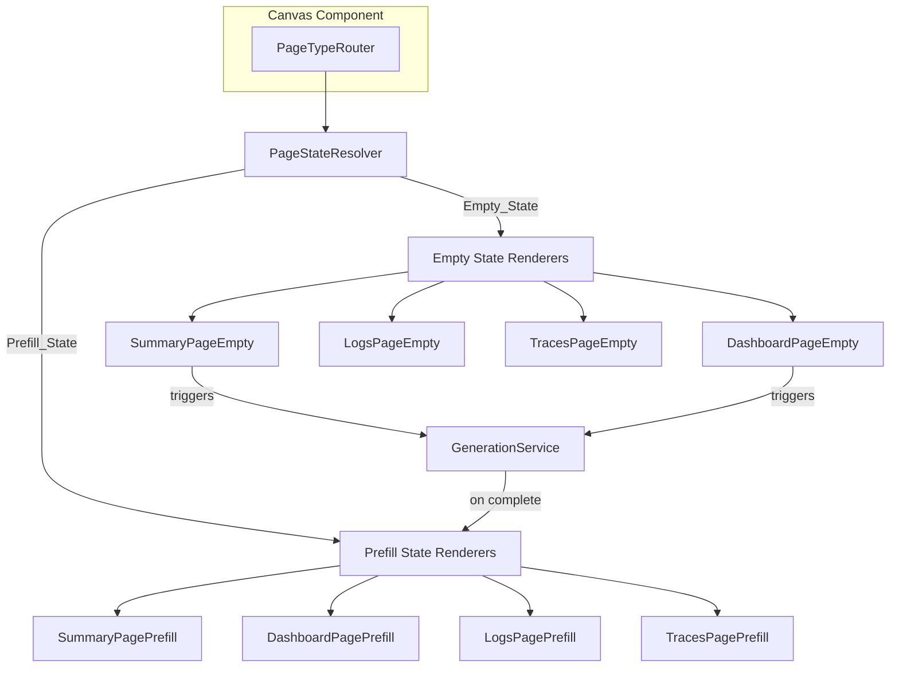
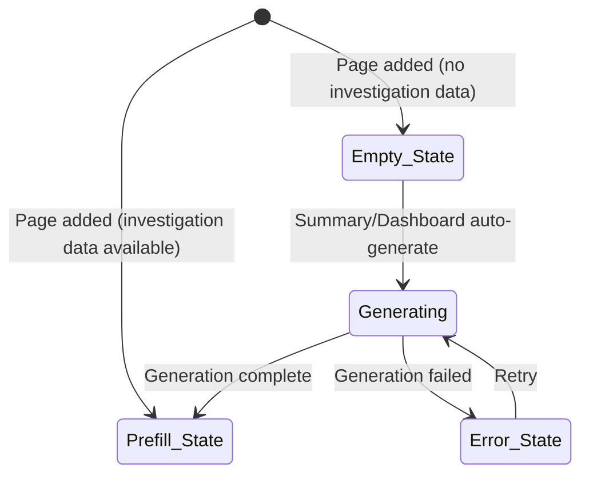

# Design Document: Workspace Page Types

## Overview

This design describes the implementation of four workspace page types — Summary, Dashboard, Logs, and Traces — each supporting two states: Empty_State and Prefill_State. The system extends the existing Canvas and ViewList infrastructure to render type-specific page components based on the `CanvasPage.type` field.

Key behaviors:
- Summary and Dashboard pages auto-generate content in Empty_State, showing a generating animation during the process
- Logs Empty_State renders the log viewer structure (field sidebar, search bar, histogram, results table) with zero results
- Traces Empty_State mirrors the Prefill_State layout but with empty data fields
- Prefill_State for all pages uses investigation data as content
- Generation failures show an error message with a retry option
- Page removal cleans up any active generation processes

The implementation builds on the existing React/TypeScript/Vite stack with shadcn/ui components and Tailwind CSS.

## Architecture

The page type system is a rendering layer that sits between the Canvas component and individual page components. It introduces a page type registry, a state resolver that determines Empty_State vs Prefill_State, and a generation service for Summary/Dashboard auto-generation.





## Components and Interfaces

### Page Type Registry

A constant map that defines the four supported page types and their metadata:

```typescript
// src/components/pages/page-types.ts
export const PAGE_TYPES = {
  summary: { id: 'summary', label: 'Summary', autoGenerates: true },
  dashboard: { id: 'dashboard', label: 'Dashboard', autoGenerates: true },
  logs: { id: 'logs', label: 'Logs', autoGenerates: false },
  traces: { id: 'traces', label: 'Traces', autoGenerates: false },
} as const;

export type PageTypeId = keyof typeof PAGE_TYPES;
```

### PageStateResolver

Determines which state to render based on investigation data availability:

```typescript
function resolvePageState(page: CanvasPage, hasInvestigationData: boolean): 'empty' | 'prefill' {
  return hasInvestigationData ? 'prefill' : 'empty';
}
```

### PageTypeRouter

Replaces the current `PagePlaceholder` in Canvas.tsx. Routes to the correct component based on page type and state:

```typescript
interface PageTypeRouterProps {
  page: CanvasPage;
  hasInvestigationData: boolean;
  onGenerationComplete?: (pageId: string, content: string) => void;
  onGenerationError?: (pageId: string, error: string) => void;
}
```

### Page Components

Each page type has two components (empty and prefill):

| Page Type | Empty Component | Prefill Component |
|-----------|----------------|-------------------|
| Summary | `SummaryPageEmpty` — triggers generation, shows `GeneratingAnimation`, then renders result | `SummaryPagePrefill` — renders investigation summary data |
| Dashboard | `DashboardPageEmpty` — triggers generation, shows `GeneratingAnimation`, then renders result | `DashboardPagePrefill` — renders investigation metrics using existing `DashboardPage` layout |
| Logs | `LogsPageEmpty` — renders log viewer structure with zero results | `LogsPagePrefill` — renders investigation logs using existing `DiscoverPage` layout |
| Traces | `TracesPageEmpty` — renders trace viewer layout with empty data | `TracesPagePrefill` — renders trace data per Figma design |

### GeneratingAnimation Component

A shared loading indicator used by Summary and Dashboard empty states:

```typescript
interface GeneratingAnimationProps {
  label?: string; // e.g. "Generating summary..." or "Generating dashboard..."
}
```

Renders a pulsing/skeleton animation that communicates content generation is in progress. The component covers the page content area and prevents user interaction via a pointer-events overlay.

### GenerationService

Handles the async content generation for Summary and Dashboard pages:

```typescript
// src/services/generation-service.ts
interface GenerationResult {
  content: string;
  error?: string;
}

export const GenerationService = {
  generateSummary(workspacePages: CanvasPage[]): Promise<GenerationResult>;
  generateDashboard(workspacePages: CanvasPage[]): Promise<GenerationResult>;
  cancelGeneration(pageId: string): void;
};
```

The service simulates generation with a delay (for the prototype) and supports cancellation for cleanup when pages are removed.

### TracesPage Components

The Traces page follows the Figma design at https://www.figma.com/design/hIFos0EJcHGGgujwCVNieT/Olly-Pattern-Explore?node-id=54-1700.

Key layout elements:
- Service map / span waterfall visualization
- Span hierarchy tree with timing bars
- Service attribution labels
- Duration and timestamp columns

## Data Models

### Extended CanvasPage

The existing `CanvasPage` type is extended with page state tracking:

```typescript
export interface CanvasPage {
  id: string;
  type: string;           // 'summary' | 'dashboard' | 'logs' | 'traces' (+ existing types)
  title: string;
  order: number;
  content?: string;
  generationStatus?: 'idle' | 'generating' | 'complete' | 'error';
  generationError?: string;
}
```

### PageTypeConfig

```typescript
export interface PageTypeConfig {
  id: string;
  label: string;
  autoGenerates: boolean;
}
```

### TraceData (for Traces page)

```typescript
export interface TraceSpan {
  spanId: string;
  traceId: string;
  parentSpanId?: string;
  serviceName: string;
  operationName: string;
  startTime: number;
  duration: number;
  status: 'ok' | 'error';
}

export interface TraceData {
  traceId: string;
  rootSpan: TraceSpan;
  spans: TraceSpan[];
  totalDuration: number;
}
```

### InvestigationData (for Prefill states)

```typescript
export interface InvestigationData {
  summaryContent?: string;
  dashboardMetrics?: DashboardMetrics;
  logEntries?: LogEntry[];
  traceData?: TraceData[];
}
```


## Correctness Properties

*A property is a characteristic or behavior that should hold true across all valid executions of a system — essentially, a formal statement about what the system should do. Properties serve as the bridge between human-readable specifications and machine-verifiable correctness guarantees.*

### Property 1: Unique page type identifiers

*For any* two distinct page types in the registry, their type identifiers must be different.

**Validates: Requirements 1.3**

### Property 2: State resolution correctness

*For any* page type and any boolean `hasInvestigationData`, the state resolver must return `'empty'` when `hasInvestigationData` is false and `'prefill'` when `hasInvestigationData` is true. This must hold for all four page types uniformly.

**Validates: Requirements 2.1, 2.2, 2.3**

### Property 3: Prefill state renders investigation data

*For any* page type and any valid investigation data for that type, the prefill state renderer must include the provided data in its output. Specifically: summary content for Summary pages, metric values for Dashboard pages, log entries for Logs pages, and span/service/timing information for Traces pages.

**Validates: Requirements 4.1, 6.1, 8.1, 10.2**

### Property 4: Generation blocks interaction

*For any* page that has `generationStatus === 'generating'`, the rendered output must include an overlay that prevents pointer events on the content area.

**Validates: Requirements 11.2**

### Property 5: Page creation assigns correct type

*For any* page type selected from the add-page menu, the resulting `CanvasPage` entry must have its `type` field set to the corresponding type identifier from the registry.

**Validates: Requirements 12.1**

### Property 6: Page type routing correctness

*For any* `CanvasPage` with a type field matching a registered page type, the `PageTypeRouter` must render the component associated with that type and the resolved state (empty or prefill).

**Validates: Requirements 12.2**

### Property 7: Generation cleanup on page removal

*For any* page with an active generation process (`generationStatus === 'generating'`), removing that page from the canvas must invoke cancellation of the generation process, ensuring no orphaned async operations remain.

**Validates: Requirements 12.3**

## Error Handling

| Scenario | Behavior |
|----------|----------|
| Generation fails (Summary/Dashboard) | Replace `GeneratingAnimation` with error message and retry button. Set `generationStatus` to `'error'` and store error in `generationError`. |
| Retry after failure | Reset `generationStatus` to `'generating'`, clear `generationError`, re-initiate generation. |
| Page removed during generation | Call `GenerationService.cancelGeneration(pageId)` to abort the async operation. Ignore any subsequent callbacks for that page. |
| Unknown page type in Canvas | Render a fallback generic placeholder (existing behavior in `PagePlaceholder`). |
| Missing investigation data for Prefill | Fall back to Empty_State rendering. The state resolver treats missing data as `hasInvestigationData = false`. |
| Component render error | Use React Error Boundary around each page to catch render errors and show a retry UI (existing pattern in Canvas error handling). |

## Testing Strategy

### Unit Tests

Unit tests cover specific examples, edge cases, and integration points:

- Page type registry contains exactly 4 types (Summary, Dashboard, Logs, Traces) — validates Req 1.1
- Add-page menu lists all four page types — validates Req 1.2
- Summary/Dashboard empty state triggers generation service on mount — validates Req 3.1, 5.1
- GeneratingAnimation renders during generation — validates Req 3.2, 5.2
- Content replaces animation after generation completes — validates Req 3.3, 5.3
- Logs empty state renders field sidebar, search bar, histogram, results table with zero results — validates Req 7.1, 7.2
- Traces empty state renders trace viewer structure with empty data — validates Req 9.1, 9.2
- Generation failure shows error message and retry button — validates Req 11.3
- GeneratingAnimation renders a visible loading indicator — validates Req 11.1

### Property-Based Tests

Property-based tests use `fast-check` (the standard PBT library for TypeScript/JavaScript) to verify universal properties across generated inputs. Each test runs a minimum of 100 iterations.

Each property test is tagged with a comment referencing the design property:

| Test | Property | Tag |
|------|----------|-----|
| Unique identifiers | Property 1 | `Feature: workspace-page-types, Property 1: Unique page type identifiers` |
| State resolution | Property 2 | `Feature: workspace-page-types, Property 2: State resolution correctness` |
| Prefill data rendering | Property 3 | `Feature: workspace-page-types, Property 3: Prefill state renders investigation data` |
| Generation blocks interaction | Property 4 | `Feature: workspace-page-types, Property 4: Generation blocks interaction` |
| Page creation type assignment | Property 5 | `Feature: workspace-page-types, Property 5: Page creation assigns correct type` |
| Page type routing | Property 6 | `Feature: workspace-page-types, Property 6: Page type routing correctness` |
| Generation cleanup | Property 7 | `Feature: workspace-page-types, Property 7: Generation cleanup on page removal` |

Each correctness property is implemented by a single property-based test. Property tests generate random page types, investigation data shapes, and generation states to verify the properties hold universally.
